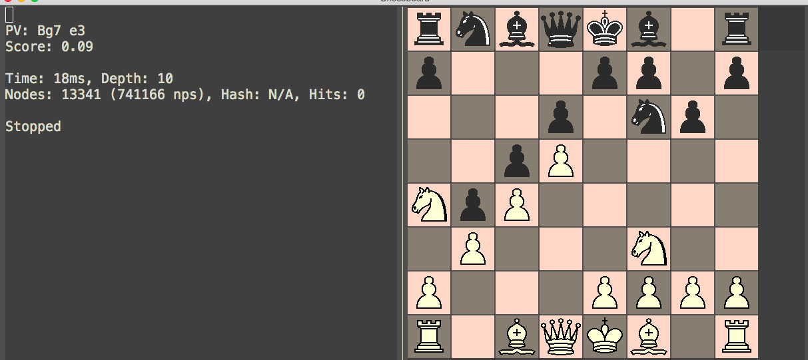

# Chess Engine.lisp

This started out as a Common Lisp project but is now an emacs script that works with `emacs-chess` to support engine analysis (by using e.g Stockfish).

Screenie:

## Usage:
Use `emacs-chess` to read a chess game using `chess-pgn-read`. I recommend that you decrease the image size until you have a chessboard that covers only half the frame.

Once you have the board up and running, load `analysis.el` then type `chess-analysis-bindings` to install some key bindings.

Now you can get a quick analysis of every position by using the `n` and `p` keys to navigate back and forth. There is also `C-c C-e` which prompts you for some args to send to "go". Type in "infinite" and hit enter and the engine begins to search. Type `C-c C-g` when you are done to stop the engine again.

There should be a buffer `Chess Analysis Overview` which will always contain up to date info about what the engine is doing.

## Dependencies

I am new to elisp so am probably doing a lot of silly stuff, but here is what I know needs to be installed for this script to work:

- String manipulation script: https://github.com/magnars/s.el

- Stockfish chess engine in a Emacs' executable path